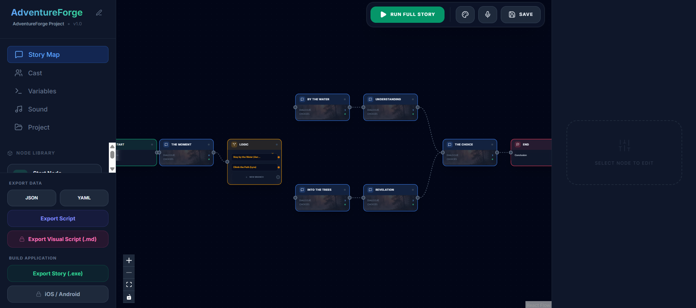
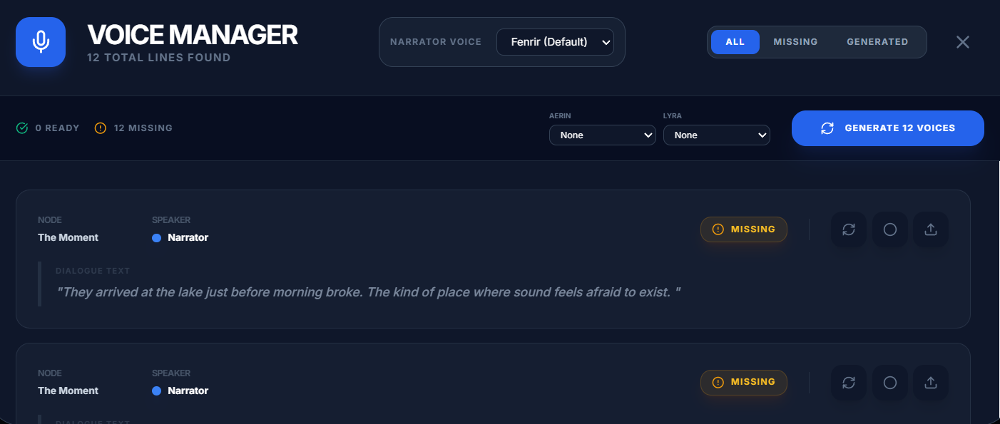

[](https://buymeacoffee.com/yuchenghuang)

<div align="center">



<h1>StoryFlow: AI-Powered Visual Novel Editor</h1>

**Flow-based Visual Novel Editor with AI-powered voice over, node-based logic, and advanced story development staging.**

</div>

---

## 🎥 Visual Demo


---

## 🤖 AI-Powered Functions
StoryFlow integrates modern AI to streamline the creation process:
- **AI Voice Over (TTS)**: Automatically generate high-quality character voices using the Google TTS / Gemini API integration.
- **LLM-Driven Branching**: (In Progress) Use LLMs to determine story flow based on user input, creating dynamic, conversational experiences.
- **Smart Staging**: Automated health checks that identify missing assets or broken paths instantly.

---

## ✨ Key Features

### 🛠 Node-Based Flow (The "ComfyUI" Feel)
- **Logic Nodes**:Expression-based conditions (`gold > 10`) and variable setters for complex branching.
- **Visual Connectivity**: Organize your story with Start, Scene, Logic, and End nodes.
- **[NEW] Smart End Logic**: Graceful story conclusions with state reset.

### 🎨 Visual Scene Editor (The "TyranoBuilder" Feel)
- **WYSIWYG Staging**: Drag and drop characters directly onto the scene canvas.
- **Real-Time Preview**: Instant feedback on text box styling and character placement.
- **Scale & Flip**: Visual controls to adjust character size and facing.

<div align="center">


</div>

### 🎭 Advanced Dialogue System
- **Character Themes**: Unique text box styles for different speakers.
- **Visual Styling**: Customize colors, opacity, fonts, and dimensions (Width/Height/Position).
- **Auto-Pagination**: Algorithmic splitting of long text to fit any container.

---

## 📝 TODO Features (Phase 3 & 4)
- [ ] **Animation System**: Support for `fade`, `slide`, `shake`, and `dissolve` transitions.
- [ ] **Super Node (Route Container)**: Collapsible nodes to contain entire story branches (e.g., "Route A").
- [ ] **Asset Library**: Integrated file browser for easier asset management.
- [ ] **Dice Roll System**: RPG-style mechanics with visual dice overlays.
- [ ] **History System**: A scrollable log of previous dialogue.

---

## 💻 Execution & Build

### Prerequisites
- Node.js (v18+)
- Python 3.10+ (for backend server)

### 1. Development Mode
```bash
# Install dependencies
npm install

# Start the Editor and Backend (Concurrent)
npm run dev:stack
```

### 2. Exporting Your Game
- **Export Story (.exe)**: Build a standalone player for your readers.
- **Mobile Support**: Export to **Android** and **iOS** via Capacitor.
- **Developer Mode Check**: Automated pre-build validation for Windows users.

---

## 🗺 Roadmap
See [PROJECT.md](PROJECT.md) for the detailed development roadmap.
